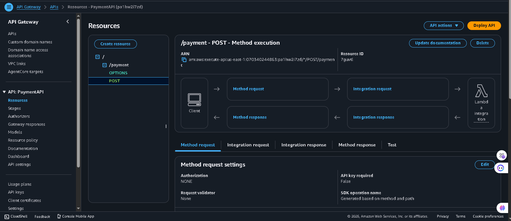
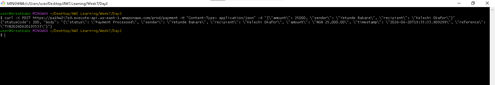
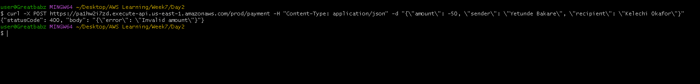

[openapi (1).yaml](https://github.com/user-attachments/files/29166243/openapi.1.yaml)
# payment-api-gateway[PaymentAPI-README.md](https://github.com/user-attachments/files/29166248/PaymentAPI-README.md)# PaymentAPI — REST API with API Gateway & Lambda

A public, serverless REST API built on Amazon API Gateway and AWS Lambda. Accepts payment notification payloads, validates the amount, and returns a structured JSON response — fully callable from anywhere on the internet. Built as part of the AWS Cloud Accelerator — Week 7, Day 2.

---

## Live API

```bash
curl -X POST https://pa1hw2i7zd.execute-api.us-east-1.amazonaws.com/prod/payment \
  -H "Content-Type: application/json" \
  -d '{"amount": 25000, "sender": "Yetunde Bakare", "recipient": "Kelechi Okafor"}'
```

Full API documentation (paths, schemas, examples) is available in [`openapi.yaml`](./openapi.yaml).

---

## Architecture

```
Client → API Gateway (POST /payment) → Lambda function → Validate amount → Format response → CloudWatch logs
```

- **API Gateway:** REST API, regional endpoint, stage `prod`
- **Backend:** AWS Lambda, Python 3.12
- **CORS:** Enabled, allowing browser-based clients to call the API
- **Configuration:** Currency is read from a Lambda environment variable, not hardcoded

---

## Lambda Function Code

```python
import json
import os
from datetime import datetime

def lambda_handler(event, context):
    currency = os.environ.get('CURRENCY', 'NGN')
    amount = event.get('amount', 0)
    sender = event.get('sender', 'Unknown')
    recipient = event.get('recipient', 'Unknown')

    if amount <= 0:
        return {'statusCode': 400, 'body': json.dumps({'error': 'Invalid amount'})}

    notification = {
        'status': 'Payment Processed',
        'sender': sender,
        'recipient': recipient,
        'amount': f'{currency} {amount:,.2f}',
        'timestamp': datetime.now().isoformat(),
        'reference': f'TXN{datetime.now().strftime("%Y%m%d%H%M%S")}'
    }

    print(f'Payment processed: {json.dumps(notification)}')
    return {'statusCode': 200, 'body': json.dumps(notification)}
```

> The underlying Lambda function was originally built and tested standalone in [lambda-payment-notification](https://github.com/Greatbabz/lambda-payment-notification) — this repo documents the API Gateway layer placed in front of it.

---

## Sample Requests

**Valid payment:**
```json
{
  "amount": 25000,
  "sender": "Yetunde Bakare",
  "recipient": "Kelechi Okafor"
}
```

**Expected response (200):**
```json
{
  "statusCode": 200,
  "body": "{\"status\": \"Payment Processed\", \"sender\": \"Yetunde Bakare\", \"recipient\": \"Kelechi Okafor\", \"amount\": \"NGN 25,000.00\", \"timestamp\": \"2026-06-20T09:13:24.080991\", \"reference\": \"TXN20260620091324\"}"
}
```

**Invalid amount:**
```json
{
  "amount": -50,
  "sender": "Yetunde Bakare",
  "recipient": "Kelechi Okafor"
}
```

**Expected response (400):**
```json
{
  "statusCode": 400,
  "body": "{\"error\": \"Invalid amount\"}"
}
```

---

## Setup Instructions

1. Deploy the Lambda function (see code above) — runtime Python 3.12
2. Go to **API Gateway → Create API → REST API → Build**
3. Create a resource: `/payment`
4. Add a **POST** method on `/payment`, integration type **Lambda function**, pointing to your function
5. Enable **CORS** on the resource
6. **Deploy API** → create a new stage named `prod`
7. Copy the generated **Invoke URL** — that's your live endpoint

---

## Screenshots

**API Gateway — deployed POST /payment endpoint:**


**Successful API call (200):**


**Error response — invalid amount (400):**


---

## Key Observations

- **Fully serverless:** no servers provisioned, patched, or managed — API Gateway and Lambda both scale automatically.
- **CORS matters:** without enabling CORS, this API would reject requests made from a browser-based frontend (e.g. a React app calling it via `fetch`), even though curl/Postman calls would still succeed. CORS only affects browser-enforced restrictions.
- **Stage-based deployment:** API Gateway requires an explicit **Deploy** step to a named stage (`prod`) — changes to methods or CORS settings don't take effect until redeployed.

---

*Project completed as part of the AWS Cloud Accelerator — Week 7, Day 2.*
